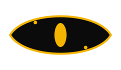

<div align="center">
  
  <br /><br />

  <h1>
    <picture>
      <source media="(prefers-color-scheme: dark)" srcset="https://readme-typing-svg.demolab.com?font=Dancing+Script&weight=700&size=72&pause=1000&color=FFB400&center=true&vCenter=true&width=500&height=100&lines=Leopard" />
      
    </picture>
  </h1>

  <p><code>Predatory precision. Lightning speed.</code></p>

  <p>
    <a href="https://leopardai.vercel.app">
      
    </a>
    &nbsp;
    
    &nbsp;
    
  </p>
</div>

---

Leopard is an AI chat interface that gets out of your way. No clutter, no gimmicks. You open it, you talk, it responds. Your conversations stay organized, your code previews right in the chat, and everything moves fast.

<br />

## What it does

| Feature | Description |
|---|---|
| Real-time chat | Streams responses token by token, no waiting |
| Code canvas | Preview HTML, React, SVG, Mermaid and more inline |
| File uploads | Drag, paste or attach images and code files as context |
| Chat history | All your conversations, organized and searchable |
| Export | Download any conversation as Markdown |
| Share | Send a chat to anyone with a link |
| Model switching | Pick your model per conversation |

<br />

## Stack

- **[Next.js 16](https://nextjs.org)** — full-stack framework with App Router
- **[Convex](https://convex.dev)** — real-time database with live queries
- **[Clerk](https://clerk.com)** — authentication via Google OAuth
- **[NVIDIA NIM](https://build.nvidia.com)** — inference API for LLMs

<br />

## Running locally

```bash
git clone https://github.com/dheraingoud/LeopardAI.git
cd LeopardAI
npm install
```

Copy the example environment file and fill in your keys:

```bash
cp .env.example .env.local
```

```env
NEXT_PUBLIC_CLERK_PUBLISHABLE_KEY=pk_...
CLERK_SECRET_KEY=sk_...
NEXT_PUBLIC_CONVEX_URL=https://...convex.cloud
NVIDIA_API_KEY=nvapi-...
```

Then start the dev server:

```bash
npm run dev
```

Open [http://localhost:3000](http://localhost:3000).

<br />

## Project layout

```
app/              Pages and API routes (Next.js App Router)
components/       UI components (sidebar, message, canvas, etc.)
convex/           Database schema, queries, and mutations
hooks/            Shared React hooks (streaming, media upload)
lib/              Utilities
public/           Static assets
types/            Shared TypeScript types
```

<br />

---

<div align="center">
  <sub>Built for speed. Kept simple on purpose.</sub>
</div>
